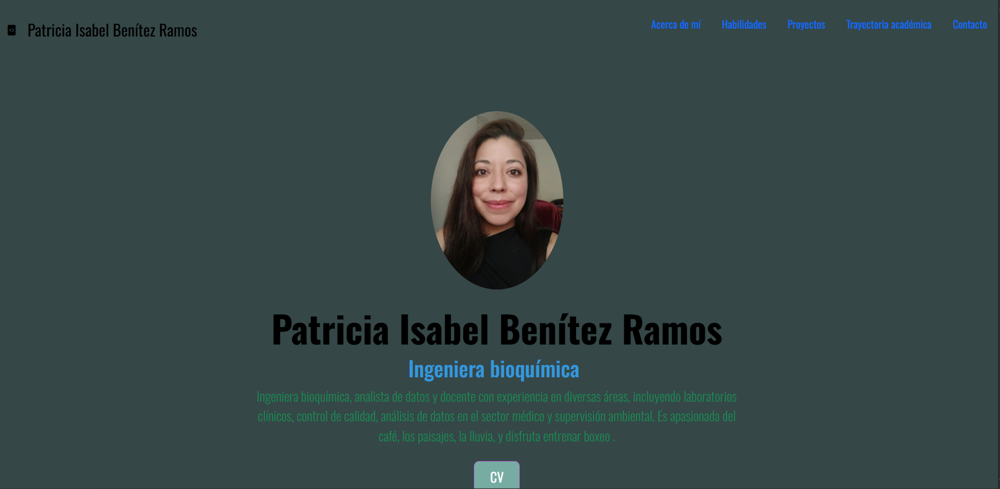

### PORTAFOLIO DE PROYECTOS
Mi nombre es **Isabel Benitez** soy Ingeniera bioquímica, apasionada por la tecnología.

En este portafolio encontrarás proyectos utilizando ciencia de datos, con herramientas como Python, SQL, Google BigQuery, bases de datos MongoDB, SQL, y visualización con Power BI (DAX).

__________
### SECCIONES
- 🛠️Habilidades
- 🗂️Proyectos
- 🗣️ Recomendaciones
- 📧 Contacto
### CREADO CON:
- HTML
- CSS
- JavaScript

    
    

### Vista previa

*Contacto*
[brpisabel@gmail.com](mailto:brpisabelgmail.com)

    